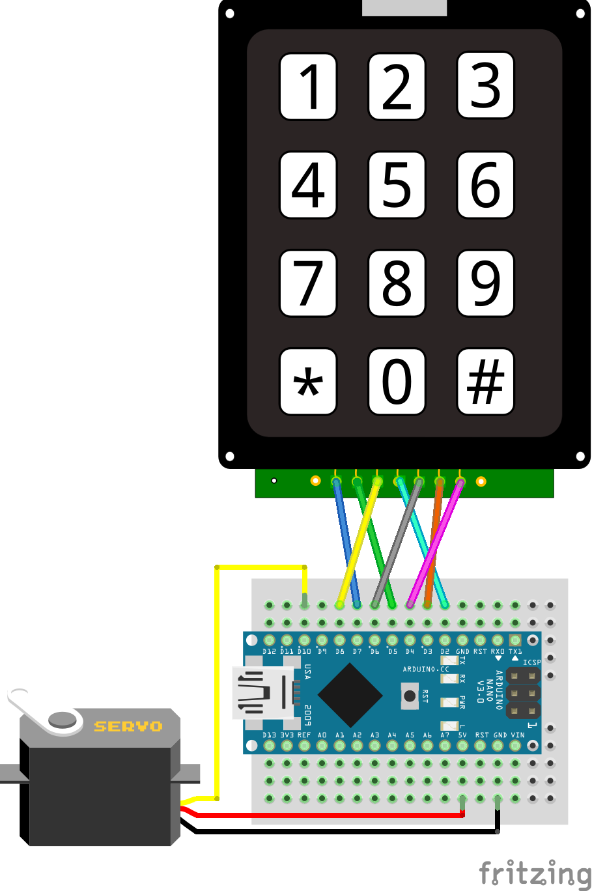

# Gongzipsa 금고 키트 제작
키패드와 서보모터를 이용한 금고 키트

## 사용 부품
- 아두이노 나노
- 서보모터 SG90 1개
- 3*4 키패드 1개

## 라이브러리
- Keypad by Mark Stanley, Alexander Brevig

## 연결
### 결선표
|아두이노 나노|3*4 키패드|서보모터|
|--|--|--|
|5V||+|
|GND||-|
|D2|4||
|D3|6||
|D4|7||
|D5|2||
|D6|5||
|D7|1||
|D8|3||
|D10||S|

### 연결 이미지

## 제품 사진
- 추후 추가 예정

## 코드별 설명
- 첫번째 코드는 교육용이라기엔 난이도가 있다고 판단. 상대적으로 낮춘 두번째코드로 키트 제작 예정
### 1st code
- 비밀번호 자릿수 설정 가능, 시리얼 모니터에 현재 상태 표기
### 2nd code
- 비밀번호 4자리 고정, 시리얼 모니터 사용안함.

## 진행상황
|날짜|진행사항|특이사항|
|--|--|--|
|2022/12/27|회로 연결 후 테스트 完||
|2022/12/18|기존 코드 기능 제외 버전 제작||